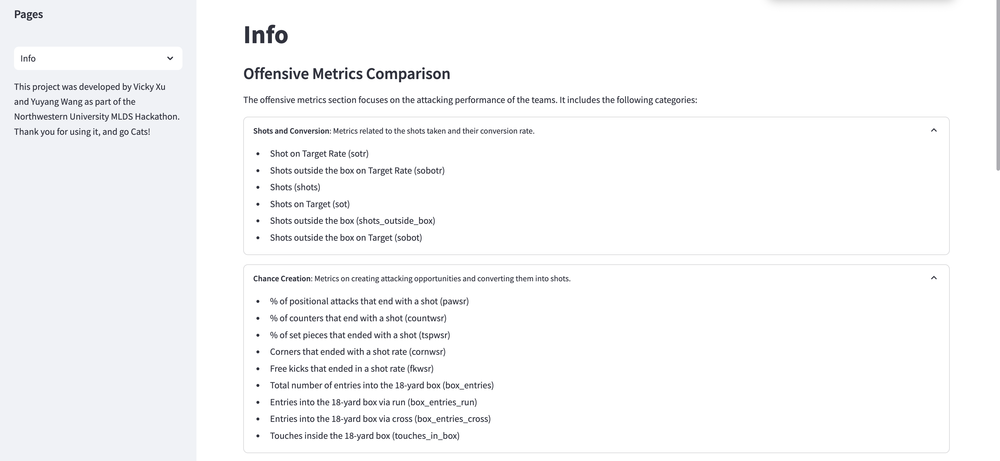

# Soccer Team Performance Dashboard

## Overview
In soccer, a successful team combines both offensive and defensive strategies to secure victory. Our goal is to use data-driven insights to track trends and improve team performance. By analyzing key metrics, we can evaluate strategies, monitor individual player performance, and provide actionable feedback for better coaching and training decisions.

We started by researching team dynamics through video analysis and reading relevant materials, then expanded our understanding with additional resources. Our tool is designed to help coaching staff evaluate team performance, access critical metrics, and create effective training plans to enhance player skills and overall team success.

## Motivation
Coaches and staff can leverage this dashboard to gain deeper insights into their team's performance. By visualizing trends and comparing with other teams, coaching staff can make data-backed decisions that guide training sessions, game strategies, and player development.

## Project Walkthrough
## Step 1: Data Exploration and Machine Learning
### Objective
Predict match outcomes and evaluate the impact of key features on team performance, later implemented in the dashboard.

### Key Activities
1. **Logistic Regression for Outcome Prediction**
   - Built a logistic regression model to predict match results (win, lose, or draw).
   - Conducted sensitivity analysis to determine the effect of features such as shots, passing accuracy, and defensive stats on win rate.

2. **Model Training and Evaluation**
   - Utilized **scikit-learn** for preprocessing, including feature scaling and train-test splitting.
   - Evaluated model performance using the following metrics:
     - **Accuracy**
     - **Precision**
     - **Recall**
     - **F1-Score**
     - **ROC-AUC**

3. **Data Visualization**
   - Developed interactive visualizations with **Plotly** to interpret data trends and model performance:
     - **Confusion Matrix**: Visualized model predictions.
     - **Feature Importance Plot**: Highlighted key variables affecting predictions.
     - **Correlation Heatmap**: Examined relationships between features.

4. **Dynamic Analysis**
   - Integrated filters to analyze match data for specific teams or seasons.
   - Provided insights on performance metrics such as shots, defensive stats, and passing accuracy.

---

## Step 2: Interactive Dashboard Development
We developed an interactive dashboard for the **Northwestern Men's Soccer** coaching staff to customize teams and seasons for a more in-depth analysis of team performance. Hosted on **Streamlit**, the dashboard features three main sections:

1. **Team Analysis**  
   Provides an overview of team performance metrics, including detailed time-series analysis, sub-category metrics, and player performance breakdowns.
   

3. **Comparison Tool**  
   Enables performance comparison with other teams, helping coaches identify areas where their team excels or needs improvement.
   

5. **Information Page**  
   Offers additional insights and context for the data, including background on the metrics used and how they are calculated.
   

## Future Implications
- **Expanded Data**: Incorporating additional data formats to further refine the analysis and provide more granular insights.
- **Real-Time Match Updates**: Enabling live tracking of team performance during matches for on-the-fly adjustments.

## Key Sections of the Dashboard

### Offensive Metrics Comparison
The **Offensive Metrics** section evaluates the attacking performance of the team. It includes the following categories:

- **Shots and Conversion**: Metrics related to the shots taken and their conversion rate.
- **Chance Creation**: Metrics on creating attacking opportunities and converting them into shots.
- **Crosses and Penetration**: Metrics that measure the success of crosses and entries into the attacking zone.
- **Passing Effectiveness**: Metrics assessing the team's passing accuracy and effectiveness in offensive play.

### Defensive Metrics Comparison
The **Defensive Metrics** section analyzes the team's defensive strength. It includes the following categories:

- **Defensive Solidity**: Metrics related to the team's ability to defend against attacks.
- **Ball Recovery**: Metrics assessing how well the team recovers possession from opponents.
- **Pressing Efficiency**: Metrics related to the team’s pressing game and its effectiveness in disrupting opponent possession.

### Other Metrics Comparison
The **Other Metrics** section includes additional performance indicators that don't fit neatly into offensive or defensive categories. It includes the following categories:

- **Possession and Passing**: Metrics related to possession control and the effectiveness of passing.
- **Discipline**: Metrics concerning player behavior, such as fouls and card accumulation.

## Installation & Usage
To use this dashboard:

1. Clone the repository:  
   ```bash
   git clone https://github.com/your-repo/soccer-dashboard.git

2. Set up:
   ```bash
   python3 --version
   python3 -m venv venv
   source venv/bin/activate

3. Install the requirements.txt
   ```bash
   pip install -r requirements.txt

4. Run the app:
   ```bash
   streamlit run app.py
